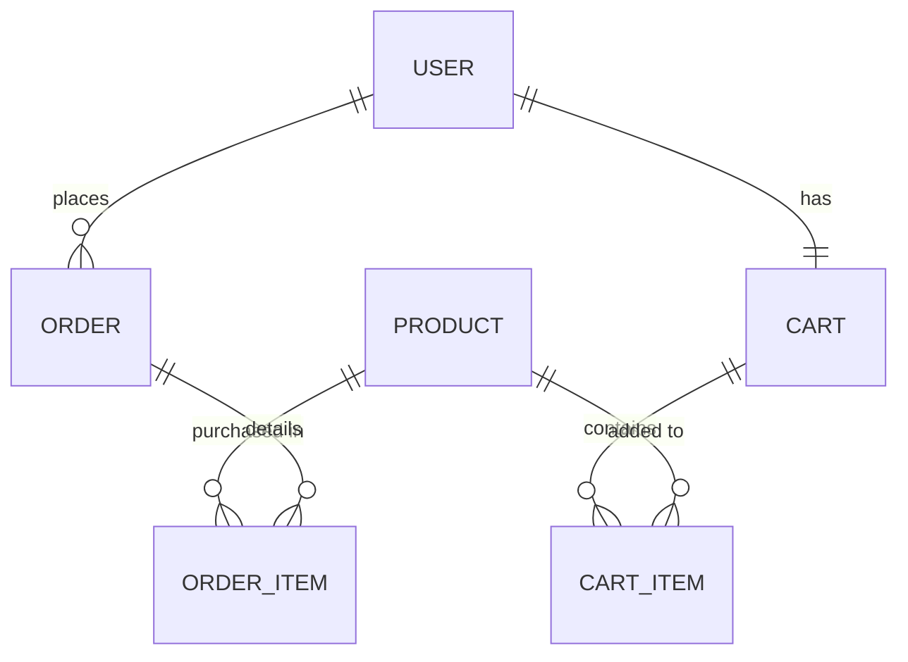

# Spring Boot Backend Integration Guide

This guide helps you connect your Spring Boot backend to this Next.js frontend application.

---

## 1. CORS Configuration (Cross-Origin Resource Sharing)

Since the Next.js app runs on `http://localhost:3000` and Spring Boot typically runs on `http://localhost:8080`, you must enable CORS to allow the frontend to make requests.

Create a configuration class in your Spring Boot application:

```java
package com.medkart.config;

import org.springframework.context.annotation.Bean;
import org.springframework.context.annotation.Configuration;
import org.springframework.web.servlet.config.annotation.CorsRegistry;
import org.springframework.web.servlet.config.annotation.WebMvcConfigurer;

@Configuration
public class CorsConfig {

    @Bean
    public WebMvcConfigurer corsConfigurer() {
        return new WebMvcConfigurer() {
            @Override
            public void addCorsMappings(CorsRegistry registry) {
                registry.addMapping("/api/**")
                        .allowedOrigins("http://localhost:3000")
                        .allowedMethods("GET", "POST", "PUT", "DELETE", "OPTIONS")
                        .allowedHeaders("Origin", "Content-Type", "Accept", "Authorization")
                        .allowCredentials(true)
                        .maxAge(3600);
            }
        };
    }
}
```

---

## 2. JWT Authentication Workflow

The frontend stores the JWT in `localStorage` and sends it in the `Authorization` header as a Bearer token:
`Authorization: Bearer <your_jwt_token>`

In Spring Security, configure your filter chain to intercept requests, read the header, validate the JWT, and set the user session in the Security Context:

```java
// Example interceptor header extraction
String authHeader = request.getHeader("Authorization");
if (authHeader != null && authHeader.startsWith("Bearer ")) {
    String jwtToken = authHeader.substring(7);
    String email = jwtService.extractEmail(jwtToken);
    // Authenticate user...
}
```

---

## 3. Database Entity Models (Reference Schema)

Here are the standard entity associations expected by the frontend:



### Key Schemas:

1. **User**: `id`, `name`, `email`, `password` (hashed), `role` (e.g. `CUSTOMER`, `ADMIN`).
2. **Product**: `id`, `name`, `description`, `price`, `imageUrl`, `category`, `stockQuantity`.
3. **CartItem**: `id`, `cart_id`, `product_id`, `quantity`.
4. **Order**: `id`, `user_id`, `orderDate` (timestamp), `orderStatus` (e.g., `PENDING`, `SHIPPED`, `DELIVERED`), `totalPrice`, `shippingAddress`, `paymentMethod`.
5. **OrderItem**: `id`, `order_id`, `product_id`, `productName`, `price` (snapshot price at purchase), `quantity`.

---

## 4. REST Controller Blueprints

### A. Auth Controller (`POST /api/auth`)

Handles credentials authentication and user registration.

```java
@RestController
@RequestMapping("/api/auth")
public class AuthController {

    @Autowired
    private AuthService authService; // Custom service for DB checks and JWT creation

    @PostMapping("/login")
    public ResponseEntity<?> login(@RequestBody LoginRequest req) {
        // 1. Authenticate user credentials
        // 2. Generate JWT
        // 3. Return JSON structure matching frontend:
        //    { "token": "jwt_token_here", "user": { "id": "1", "name": "Sarah", "email": "sarah@mitchell.com", "role": "CUSTOMER" } }
        return ResponseEntity.ok(authResponse);
    }

    @PostMapping("/signup")
    public ResponseEntity<?> signup(@RequestBody SignupRequest req) {
        // 1. Validate email is unique
        // 2. Hash password & save new User to DB
        // 3. Generate JWT and return authResponse (same structure as login)
        return ResponseEntity.status(HttpStatus.CREATED).body(authResponse);
    }
}
```

### B. Product Controller (`GET /api/products`)

Lists all products and specific details.

```java
@RestController
@RequestMapping("/api/products")
public class ProductController {

    @Autowired
    private ProductRepository productRepository;

    @GetMapping
    public List<Product> getAllProducts() {
        return productRepository.findAll();
    }

    @GetMapping("/{id}")
    public ResponseEntity<Product> getProductById(@PathVariable String id) {
        return productRepository.findById(id)
                .map(ResponseEntity::ok)
                .orElse(ResponseEntity.notFound().build());
    }
}
```

### C. Cart Controller (`/api/cart`)

Manages client cart state synchronized in database.

```java
@RestController
@RequestMapping("/api/cart")
public class CartController {

    @Autowired
    private CartService cartService;

    // Retrieve active user's cart (authenticated context using JWT token claims)
    @GetMapping
    public ResponseEntity<CartDto> getCart(Principal principal) {
        String email = principal.getName();
        return ResponseEntity.ok(cartService.getCartByUser(email));
    }

    @PostMapping("/add")
    public ResponseEntity<CartDto> addToCart(@RequestBody CartItemRequest req, Principal principal) {
        return ResponseEntity.ok(cartService.addItem(principal.getName(), req.getProductId(), req.getQuantity()));
    }

    @PutMapping("/update")
    public ResponseEntity<CartDto> updateCartItem(@RequestBody CartItemRequest req, Principal principal) {
        return ResponseEntity.ok(cartService.updateQuantity(principal.getName(), req.getProductId(), req.getQuantity()));
    }

    @DeleteMapping("/remove/{productId}")
    public ResponseEntity<CartDto> removeFromCart(@PathVariable String productId, Principal principal) {
        return ResponseEntity.ok(cartService.removeItem(principal.getName(), productId));
    }

    @PostMapping("/clear")
    public ResponseEntity<CartDto> clearCart(Principal principal) {
        return ResponseEntity.ok(cartService.clear(principal.getName()));
    }
}
```

### D. Order Controller (`/api/orders`)

Converts cart items to an official placed order record.

```java
@RestController
@RequestMapping("/api/orders")
public class OrderController {

    @Autowired
    private OrderService orderService;

    @PostMapping
    public ResponseEntity<Order> placeOrder(@RequestBody OrderRequest req, Principal principal) {
        // 1. Retrieve user's database cart items.
        // 2. Calculate grand total, check stocks, decrement product quantites.
        // 3. Save new Order entity + child OrderItems.
        // 4. Clear User's database cart.
        // 5. Return created Order record.
        Order order = orderService.createOrder(principal.getName(), req.getShippingAddress(), req.getPaymentMethod());
        return ResponseEntity.status(HttpStatus.CREATED).body(order);
    }

    @GetMapping
    public ResponseEntity<List<Order>> getOrders(Principal principal) {
        return ResponseEntity.ok(orderService.getOrdersByUser(principal.getName()));
    }
}
```

---

## 5. Hooking it up

Once you have written your Spring Boot REST controllers matching the controllers above:
1. Open [services/api.js](file:///home/manthan/Work/Task%25201/ecom-frontend/services/api.js).
2. Change the toggle `USE_MOCK_API` to `false`:
   ```javascript
   export const USE_MOCK_API = false;
   ```
3. Set your backend base URL in environment variables or edit [services/endpoints.js](file:///home/manthan/Work/Task%25201/ecom-frontend/services/endpoints.js).

---

## 6. Backend-Driven Searching, Filtering & Sorting

If you want search, category filters, and sorting to be processed directly on your Spring Boot backend rather than client-side:

### A. Spring Boot Controller & Repository Setup

Create a repository with search/filter queries (using `@Query` or Spring Data JPA):

```java
package com.medkart.repository;

import com.medkart.model.Product;
import org.springframework.data.domain.Sort;
import org.springframework.data.jpa.repository.JpaRepository;
import org.springframework.data.jpa.repository.Query;
import org.springframework.data.repository.query.Param;
import java.util.List;

public interface ProductRepository extends JpaRepository<Product, String> {

    @Query("SELECT p FROM Product p WHERE " +
           "(:category = 'All' OR p.category = :category) AND " +
           "(LOWER(p.name) LIKE LOWER(CONCAT('%', :search, '%')) OR " +
           " LOWER(p.description) LIKE LOWER(CONCAT('%', :search, '%')))")
    List<Product> searchAndFilter(
        @Param("search") String search, 
        @Param("category") String category, 
        Sort sort
    );
}
```

Update your `ProductController` to accept these request parameters:

```java
package com.medkart.controller;

import com.medkart.model.Product;
import com.medkart.repository.ProductRepository;
import org.springframework.beans.factory.annotation.Autowired;
import org.springframework.data.domain.Sort;
import org.springframework.web.bind.annotation.*;
import java.util.List;

@RestController
@RequestMapping("/api/products")
public class ProductController {

    @Autowired
    private ProductRepository productRepository;

    @GetMapping
    public List<Product> getProducts(
            @RequestParam(value = "search", required = false, defaultValue = "") String search,
            @RequestParam(value = "category", required = false, defaultValue = "All") String category,
            @RequestParam(value = "sort", required = false, defaultValue = "DEFAULT") String sort) {
        
        Sort sortingRule = Sort.unsorted();
        if ("PRICE_LOW_HIGH".equalsIgnoreCase(sort)) {
            sortingRule = Sort.by(Sort.Direction.ASC, "price");
        } else if ("PRICE_HIGH_LOW".equalsIgnoreCase(sort)) {
            sortingRule = Sort.by(Sort.Direction.DESC, "price");
        } else if ("RATING".equalsIgnoreCase(sort)) {
            sortingRule = Sort.by(Sort.Direction.DESC, "rating");
        }

        return productRepository.searchAndFilter(search, category, sortingRule);
    }
}
```

### B. Frontend Code Changes

1. **Update `services/api.js`**:
Modify the `getProducts` function in [services/api.js](file:///home/manthan/Work/Task%201/ecom-frontend/services/api.js) to accept query parameters:
```javascript
  getProducts: async (search = '', category = 'All', sort = 'DEFAULT') => {
    if (USE_MOCK_API) {
      await delay(MOCK_DELAY);
      let result = [...MOCK_PRODUCTS];
      if (search.trim() !== '') {
        const query = search.toLowerCase();
        result = result.filter(p => p.name.toLowerCase().includes(query) || p.description.toLowerCase().includes(query));
      }
      if (category !== 'All') {
        result = result.filter(p => p.category === category);
      }
      if (sort === 'PRICE_LOW_HIGH') result.sort((a, b) => a.price - b.price);
      else if (sort === 'PRICE_HIGH_LOW') result.sort((a, b) => b.price - a.price);
      else if (sort === 'RATING') result.sort((a, b) => b.rating - a.rating);
      return result;
    } else {
      const params = new URLSearchParams();
      if (search) params.append('search', search);
      if (category) params.append('category', category);
      if (sort) params.append('sort', sort);
      return request(`${ENDPOINTS.PRODUCTS}?${params.toString()}`);
    }
  },
```

2. **Update `app/products/page.js`**:
Change the query logic in [app/products/page.js](file:///home/manthan/Work/Task%201/ecom-frontend/app/products/page.js) to fetch from the API when selections update, instead of local filter checks:
```javascript
  // Fetch products whenever filters or search terms change
  useEffect(() => {
    const fetchProducts = async () => {
      setLoading(true);
      setError('');
      try {
        const data = await api.getProducts(searchQuery, selectedCategory, sortOption);
        setProducts(data);
      } catch (err) {
        console.error(err);
        setError('Failed to fetch filtered list from backend.');
      } finally {
        setLoading(false);
      }
    };

    // Debounce searches to avoid spamming requests
    const delayDebounceFn = setTimeout(() => {
      fetchProducts();
    }, 400);

    return () => clearTimeout(delayDebounceFn);
  }, [searchQuery, selectedCategory, sortOption]);

  // Then render `products` directly (removing client-side derived filteredProducts)
```
